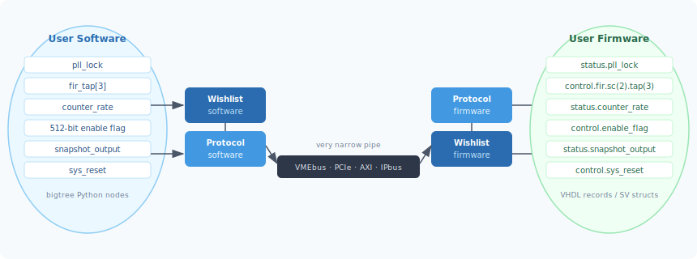
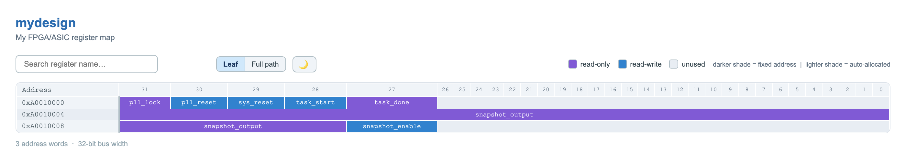
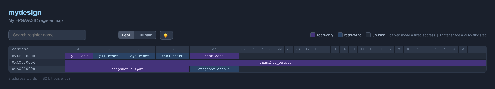
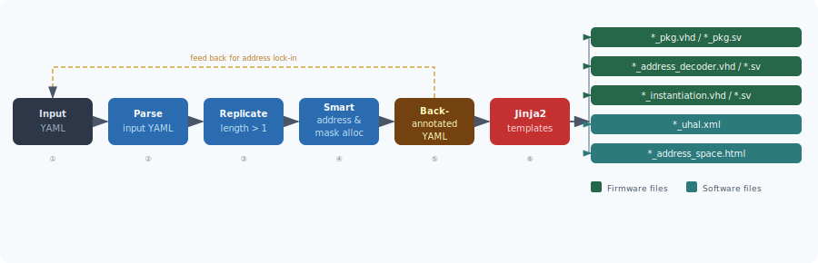
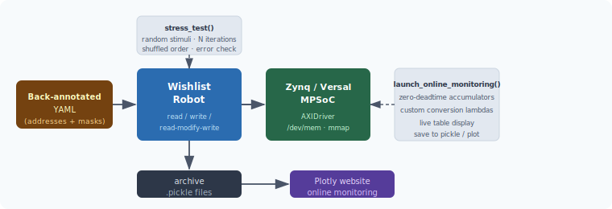

# Wishlist

> **Bridging the gap between software and firmware** — automatically generate consistent register maps, HDL packages, address decoders, and runtime interfaces from a single YAML description.

Wishlist addresses a common pain point in FPGA/ASIC-based systems: interfacing software to firmware is hard, error-prone, and time-consuming. Wishlist eliminates manual register map maintenance by treating your register definition as a single source of truth and generating everything else.



**What Wishlist generates from a single YAML file:**

| Output | Description |
|--------|-------------|
| `*_pkg.vhd` / `*_pkg.sv` | VHDL package / SystemVerilog package — hierarchical records and `typedef struct` definitions |
| `*_address_decoder.vhd` / `*_address_decoder.sv` | VHDL / SystemVerilog address decoder entity with full read-write RTL |
| `*_instantiation.vhd` / `*_instantiation.sv` | Example instantiation and self-test stimulus file |
| `*_backannotated.yaml` | YAML with computed addresses and masks written back |
| `*_uhal.xml` | uHAL register tree for IPbus-based systems |
| `*_address_space.html` | Interactive HTML register map — dark/light theme, hover tooltips, bit-range highlights, live search |

---

## Table of Contents

- [Installation](#installation)
- [Quick Start](#quick-start)
- [Generated Outputs](#generated-outputs)
  - [VHDL Package](#vhdl-package)
  - [SystemVerilog Package](#systemverilog-package)
  - [VHDL Address Decoder](#vhdl-address-decoder)
  - [SystemVerilog Address Decoder](#systemverilog-address-decoder)
- [Features in Depth](#features-in-depth)
  - [Smart Address Allocation](#1-smart-address-allocation)
  - [Packing Large Nodes and Mixing Status and Control](#2-packing-large-nodes-and-mixing-status-and-control)
  - [Hierarchical Data Structures and Replication](#3-hierarchical-data-structures-and-replication)
  - [Back-Annotated YAML and Backward Compatibility](#4-back-annotated-yaml-and-backward-compatibility)
  - [Customizable via Jinja2 Templates](#5-customizable-via-jinja2-templates)
  - [Self-Testing FW and SW Routines](#6-self-testing-fw-and-sw-routines)
- [Wishlist Robot](#wishlist-robot)
- [Linux Driver for Zynq / Versal SoCs](#linux-driver-for-zynq--versal-socs)
- [Cocotb Simulation](#cocotb-simulation)
  - [Wishbone-like Interface](#wishbone-like-interface)
  - [AXI-Lite via cocotbext-axi](#axi-lite-via-cocotbext-axi)

---

## Installation

```bash
pip install edawishlist
```

For simulation support (cocotb + AXI-Lite extension):

```bash
pip install cocotb cocotbext-axi
```

Alternatively, using a conda environment:

```bash
conda create -n wishlist -y
conda activate wishlist
pip install edawishlist cocotb cocotbext-axi
```

---

## Quick Start

**1. Write your register description in YAML:**

```yaml
# mydesign.yaml
name: mydesign
description: My FPGA/ASIC register map
address: 0xA0010000
address_width: 32
address_increment: 4
address_size: 65536
software:
  path: software
firmware:
  path: firmware
children:
  - {name: pll_lock,   width: 1,  permission: r,  description: PLL lock flag}
  - {name: pll_reset,  width: 1,  permission: rw, description: PLL reset signal}
  - {name: sys_reset,  width: 1,  permission: rw, description: System reset}
  - {name: task_start, width: 1,  permission: rw, description: Start task}
  - {name: task_done,  width: 1,  permission: r,  description: Task done flag}
  - {name: snapshot_output, width: 36, permission: r,  description: Data snapshot}
  - {name: snapshot_enable, width: 1,  permission: rw, description: Snapshot enable}
```

**2. Run Wishlist:**

```bash
wishlist mydesign.yaml
```

**3. All outputs appear in `firmware/` and `software/`:**

```
firmware/
  mydesign_pkg.vhd
  mydesign_pkg.sv
  mydesign_address_decoder.vhd
  mydesign_address_decoder.sv
  mydesign_instantiation.vhd
  mydesign_instantiation.sv
  mydesign_backannotated.yaml
software/
  mydesign_uhal.xml
  mydesign_address_space.html
```

Wishlist also generates an **interactive HTML register map** (`*_address_space.html`) — open it in any browser:



The HTML file includes:
- **Color-coded cells** — purple for read-only, blue for read-write; darker shade = fixed address, lighter = auto-allocated
- **Hover tooltip** — shows full register path, bit range, width, permission, and description
- **Bit-range highlight** — hovering a cell highlights the corresponding bit-index columns and address row
- **Live search** — filter registers by name with match count
- **Leaf / Full path toggle** — switch cell labels between leaf name and full hierarchical path
- **Dark / Light theme toggle** — both themes with matching legend swatches

---

## Generated Outputs

### VHDL Package

For the hierarchical example (`signal_processor.yaml`, included in the repo):

```yaml
children:
  - name: fir_filter_bank
    children:
      - name: channel
        length: 2          # replicated ×2
        children:
          - name: fir
            children:
              - name: sensor
                length: 6  # replicated ×6
                children:
                  - {name: tap_coeff, length: 4, width: 16, permission: rw}
                  - {name: data_rate,            width: 16, permission: r}
  - name: clk_ctrl
    children:
      - {name: pll_ref_lock, width: 1, permission: r}
      - {name: pll_dsp_lock, width: 1, permission: r}
      - {name: pll_reset,    width: 1, permission: rw}
      - {name: clk_sel,      width: 1, permission: rw}
  - name: reset_ctrl
    children:
      - {name: global_soft_rst, width: 1,  permission: rw}
      - {name: channel_rst,     length: 2, width: 1, permission: rw}
      - {name: coeff_rst,       width: 1,  permission: rw}
      - {name: rate_cnt_rst,    width: 1,  permission: rw}
  - name: sync_ctrl
    children:
      - {name: frame_sync_en, width: 1,  permission: rw}
      - {name: sync_period,   width: 16, permission: rw}
      - {name: data_refresh,  width: 1,  permission: rw}
      - {name: sync_locked,   width: 1,  permission: r}
      - {name: overflow_flag, length: 2, width: 1, permission: r}
```

Wishlist generates `signalprocessor_pkg.vhd`:

```vhdl
-- Automatically generated by WhishList - https://github.com/mvsoliveira/wishlist
-- Package name: signalprocessor_pkg
library ieee;
use ieee.std_logic_1164.all;
package signalprocessor_pkg is

-- register data types
subtype signalprocessor_fir_filter_bank_channel_fir_sensor_tap_coeff_subtype is std_logic_vector(15 downto 0);
type signalprocessor_fir_filter_bank_channel_fir_sensor_tap_coeff_array_type is array (3 downto 0)
    of signalprocessor_fir_filter_bank_channel_fir_sensor_tap_coeff_subtype;
subtype signalprocessor_fir_filter_bank_channel_fir_sensor_data_rate_subtype is std_logic_vector(15 downto 0);
subtype signalprocessor_clk_ctrl_pll_ref_lock_subtype is std_logic;
subtype signalprocessor_clk_ctrl_pll_dsp_lock_subtype is std_logic;
subtype signalprocessor_clk_ctrl_pll_reset_subtype     is std_logic;
subtype signalprocessor_clk_ctrl_clk_sel_subtype        is std_logic;
subtype signalprocessor_reset_ctrl_global_soft_rst_subtype is std_logic;
subtype signalprocessor_reset_ctrl_channel_rst_subtype     is std_logic;
type signalprocessor_reset_ctrl_channel_rst_array_type is array (1 downto 0)
    of signalprocessor_reset_ctrl_channel_rst_subtype;
subtype signalprocessor_reset_ctrl_coeff_rst_subtype    is std_logic;
subtype signalprocessor_reset_ctrl_rate_cnt_rst_subtype is std_logic;
subtype signalprocessor_sync_ctrl_frame_sync_en_subtype is std_logic;
subtype signalprocessor_sync_ctrl_sync_period_subtype   is std_logic_vector(15 downto 0);
subtype signalprocessor_sync_ctrl_data_refresh_subtype  is std_logic;
subtype signalprocessor_sync_ctrl_sync_locked_subtype   is std_logic;
subtype signalprocessor_sync_ctrl_overflow_flag_subtype is std_logic;
type signalprocessor_sync_ctrl_overflow_flag_array_type is array (1 downto 0)
    of signalprocessor_sync_ctrl_overflow_flag_subtype;

-- status hierarchy data types (read-only signals)
type signalprocessor_status_fir_filter_bank_channel_fir_sensor_record_type is record
    data_rate : signalprocessor_fir_filter_bank_channel_fir_sensor_data_rate_subtype;
end record signalprocessor_status_fir_filter_bank_channel_fir_sensor_record_type;
type signalprocessor_status_fir_filter_bank_channel_fir_sensor_array_type is array (5 downto 0)
    of signalprocessor_status_fir_filter_bank_channel_fir_sensor_record_type;
-- ... (hierarchy continues through fir → channel → fir_filter_bank)

type signalprocessor_status_clk_ctrl_record_type is record
    pll_ref_lock : signalprocessor_clk_ctrl_pll_ref_lock_subtype;
    pll_dsp_lock : signalprocessor_clk_ctrl_pll_dsp_lock_subtype;
end record signalprocessor_status_clk_ctrl_record_type;

type signalprocessor_status_sync_ctrl_record_type is record
    sync_locked   : signalprocessor_sync_ctrl_sync_locked_subtype;
    overflow_flag : signalprocessor_sync_ctrl_overflow_flag_array_type;
end record signalprocessor_status_sync_ctrl_record_type;

type signalprocessor_status_record_type is record
    fir_filter_bank : signalprocessor_status_fir_filter_bank_record_type;
    clk_ctrl        : signalprocessor_status_clk_ctrl_record_type;
    sync_ctrl       : signalprocessor_status_sync_ctrl_record_type;
end record signalprocessor_status_record_type;

-- control hierarchy data types (read-write signals)
type signalprocessor_control_fir_filter_bank_channel_fir_sensor_record_type is record
    tap_coeff : signalprocessor_fir_filter_bank_channel_fir_sensor_tap_coeff_array_type;
end record signalprocessor_control_fir_filter_bank_channel_fir_sensor_record_type;
-- ... (hierarchy continues through fir → channel → fir_filter_bank)

type signalprocessor_control_clk_ctrl_record_type is record
    pll_reset : signalprocessor_clk_ctrl_pll_reset_subtype;
    clk_sel   : signalprocessor_clk_ctrl_clk_sel_subtype;
end record signalprocessor_control_clk_ctrl_record_type;

type signalprocessor_control_reset_ctrl_record_type is record
    global_soft_rst : signalprocessor_reset_ctrl_global_soft_rst_subtype;
    channel_rst     : signalprocessor_reset_ctrl_channel_rst_array_type;
    coeff_rst       : signalprocessor_reset_ctrl_coeff_rst_subtype;
    rate_cnt_rst    : signalprocessor_reset_ctrl_rate_cnt_rst_subtype;
end record signalprocessor_control_reset_ctrl_record_type;

type signalprocessor_control_sync_ctrl_record_type is record
    frame_sync_en : signalprocessor_sync_ctrl_frame_sync_en_subtype;
    sync_period   : signalprocessor_sync_ctrl_sync_period_subtype;
    data_refresh  : signalprocessor_sync_ctrl_data_refresh_subtype;
end record signalprocessor_control_sync_ctrl_record_type;

type signalprocessor_control_record_type is record
    fir_filter_bank : signalprocessor_control_fir_filter_bank_record_type;
    clk_ctrl        : signalprocessor_control_clk_ctrl_record_type;
    reset_ctrl      : signalprocessor_control_reset_ctrl_record_type;
    sync_ctrl       : signalprocessor_control_sync_ctrl_record_type;
end record signalprocessor_control_record_type;

end package signalprocessor_pkg;
```

In your firmware, you then simply use the record fields by name — no raw addresses, no bit masks:

```vhdl
-- Firmware side: clean, self-documenting access
signal status  : signalprocessor_status_record_type;
signal control : signalprocessor_control_record_type;

-- Writing a FIR tap coefficient:
my_fir_tap <= control.fir_filter_bank.channel(0).fir.sensor(2).tap_coeff(1);

-- Reporting a data rate back to software:
status.fir_filter_bank.channel(0).fir.sensor(2).data_rate <= computed_rate;

-- Checking PLL lock and asserting reset:
status.clk_ctrl.pll_ref_lock <= pll_ref_locked_i;
control.reset_ctrl.global_soft_rst <= global_reset;

-- Reading sync status:
locked <= status.sync_ctrl.sync_locked;
```

### SystemVerilog Package

Wishlist generates an equivalent `signalprocessor_pkg.sv` using `typedef struct` and `typedef logic`:

```systemverilog
// Automatically generated by WhishList - https://github.com/mvsoliveira/wishlist
// Package name: signalprocessor_pkg
package signalprocessor_pkg;

// register data types
typedef logic [15:0] signalprocessor_fir_filter_bank_channel_fir_sensor_tap_coeff_t;
typedef signalprocessor_fir_filter_bank_channel_fir_sensor_tap_coeff_t
    signalprocessor_fir_filter_bank_channel_fir_sensor_tap_coeff_array_t [3:0];
typedef logic [15:0] signalprocessor_fir_filter_bank_channel_fir_sensor_data_rate_t;
typedef logic signalprocessor_clk_ctrl_pll_ref_lock_t;
typedef logic signalprocessor_clk_ctrl_pll_dsp_lock_t;
typedef logic signalprocessor_clk_ctrl_pll_reset_t;
typedef logic signalprocessor_clk_ctrl_clk_sel_t;
typedef logic signalprocessor_reset_ctrl_global_soft_rst_t;
typedef logic signalprocessor_reset_ctrl_channel_rst_t;
typedef signalprocessor_reset_ctrl_channel_rst_t signalprocessor_reset_ctrl_channel_rst_array_t [1:0];
typedef logic signalprocessor_sync_ctrl_sync_period_t;  // 16-bit
typedef logic signalprocessor_sync_ctrl_overflow_flag_t;
typedef signalprocessor_sync_ctrl_overflow_flag_t signalprocessor_sync_ctrl_overflow_flag_array_t [1:0];

// status hierarchy data types
typedef struct {
    signalprocessor_fir_filter_bank_channel_fir_sensor_data_rate_t data_rate;
} signalprocessor_status_fir_filter_bank_channel_fir_sensor_t;
typedef signalprocessor_status_fir_filter_bank_channel_fir_sensor_t
    signalprocessor_status_fir_filter_bank_channel_fir_sensor_array_t [5:0];
// ... (hierarchy continues through fir → channel → fir_filter_bank)

typedef struct {
    signalprocessor_clk_ctrl_pll_ref_lock_t pll_ref_lock;
    signalprocessor_clk_ctrl_pll_dsp_lock_t pll_dsp_lock;
} signalprocessor_status_clk_ctrl_t;

typedef struct {
    signalprocessor_sync_ctrl_sync_locked_t       sync_locked;
    signalprocessor_sync_ctrl_overflow_flag_array_t overflow_flag;
} signalprocessor_status_sync_ctrl_t;

typedef struct {
    signalprocessor_status_fir_filter_bank_t fir_filter_bank;
    signalprocessor_status_clk_ctrl_t        clk_ctrl;
    signalprocessor_status_sync_ctrl_t       sync_ctrl;
} signalprocessor_status_t;

// control hierarchy data types
typedef struct {
    signalprocessor_fir_filter_bank_channel_fir_sensor_tap_coeff_array_t tap_coeff;
} signalprocessor_control_fir_filter_bank_channel_fir_sensor_t;
// ... (hierarchy continues through fir → channel → fir_filter_bank)

typedef struct {
    signalprocessor_clk_ctrl_pll_reset_t pll_reset;
    signalprocessor_clk_ctrl_clk_sel_t   clk_sel;
} signalprocessor_control_clk_ctrl_t;

typedef struct {
    signalprocessor_reset_ctrl_global_soft_rst_t global_soft_rst;
    signalprocessor_reset_ctrl_channel_rst_array_t channel_rst;
    signalprocessor_reset_ctrl_coeff_rst_t       coeff_rst;
    signalprocessor_reset_ctrl_rate_cnt_rst_t    rate_cnt_rst;
} signalprocessor_control_reset_ctrl_t;

typedef struct {
    signalprocessor_sync_ctrl_frame_sync_en_t frame_sync_en;
    signalprocessor_sync_ctrl_sync_period_t   sync_period;
    signalprocessor_sync_ctrl_data_refresh_t  data_refresh;
} signalprocessor_control_sync_ctrl_t;

typedef struct {
    signalprocessor_control_fir_filter_bank_t fir_filter_bank;
    signalprocessor_control_clk_ctrl_t        clk_ctrl;
    signalprocessor_control_reset_ctrl_t      reset_ctrl;
    signalprocessor_control_sync_ctrl_t       sync_ctrl;
} signalprocessor_control_t;

endpackage : signalprocessor_pkg
```

### VHDL Address Decoder

The generated address decoder is a self-contained entity that maps register reads and writes to the hierarchical record signals, handling bit extraction, multi-word packing, and read-modify-write automatically:

```vhdl
-- Automatically generated by WhishList - https://github.com/mvsoliveira/wishlist
library ieee;
use ieee.std_logic_1164.all;
use work.signalprocessor_pkg.all;

entity signalprocessor_address_decoder is
port(
    clk_i       : in  std_logic;
    read_i      : in  std_logic;
    write_i     : in  std_logic;
    address_i   : in  std_logic_vector(31 downto 0);
    data_i      : in  std_logic_vector(31 downto 0);
    data_o      : out std_logic_vector(31 downto 0);
    write_ack_o : out std_logic;
    read_ack_o  : out std_logic;
    error_o     : out std_logic;
    signalprocessor_status_i  : in  signalprocessor_status_record_type;
    signalprocessor_control_o : out signalprocessor_control_record_type
);
end entity signalprocessor_address_decoder;

architecture rtl of signalprocessor_address_decoder is
    signal int_signalprocessor_control : signalprocessor_control_record_type;
    signal int_signalprocessor_status  : signalprocessor_status_record_type;
begin
    signalprocessor_control_o <= int_signalprocessor_control;
    int_signalprocessor_status <= signalprocessor_status_i;

    address_decoder_p : process (clk_i) is
    begin
        if rising_edge(clk_i) then
            data_o <= (others => 'X');
            write_ack_int <= '0';
            read_ack_int  <= '0';
            error_int     <= '0';
            if (read_i = '1') then
                read_ack_int <= '1';
                case address_i is
                    when X"A0010000" =>  -- ch0/sensor0: data_rate [31:16], tap_coeff(0) [15:0]
                        data_o(31 downto 16) <= int_signalprocessor_status.fir_filter_bank.channel(0).fir.sensor(0).data_rate(15 downto 0);
                        data_o(15 downto 0)  <= int_signalprocessor_control.fir_filter_bank.channel(0).fir.sensor(0).tap_coeff(0)(15 downto 0);
                    when X"A0010004" =>  -- ch0/sensor0: tap_coeff(1) [31:16], tap_coeff(2) [15:0]
                        data_o(31 downto 16) <= int_signalprocessor_control.fir_filter_bank.channel(0).fir.sensor(0).tap_coeff(1)(15 downto 0);
                        data_o(15 downto 0)  <= int_signalprocessor_control.fir_filter_bank.channel(0).fir.sensor(0).tap_coeff(2)(15 downto 0);
                    -- ... (30 more addresses for FIR bank, addresses 0x08–0x74)
                    when X"A0010078" =>  -- clk_ctrl / reset_ctrl / sync_ctrl packed into one word
                        data_o(31) <= int_signalprocessor_status.clk_ctrl.pll_ref_lock;
                        data_o(30) <= int_signalprocessor_status.clk_ctrl.pll_dsp_lock;
                        data_o(29) <= int_signalprocessor_control.clk_ctrl.pll_reset;
                        data_o(28) <= int_signalprocessor_control.clk_ctrl.clk_sel;
                        data_o(27) <= int_signalprocessor_control.reset_ctrl.global_soft_rst;
                        data_o(26) <= int_signalprocessor_control.reset_ctrl.coeff_rst;
                        data_o(25) <= int_signalprocessor_control.reset_ctrl.rate_cnt_rst;
                        data_o(24) <= int_signalprocessor_control.reset_ctrl.channel_rst(0);
                        data_o(23) <= int_signalprocessor_control.reset_ctrl.channel_rst(1);
                        data_o(22) <= int_signalprocessor_control.sync_ctrl.frame_sync_en;
                        data_o(21 downto 6) <= int_signalprocessor_control.sync_ctrl.sync_period(15 downto 0);
                        data_o(5)  <= int_signalprocessor_control.sync_ctrl.data_refresh;
                        data_o(4)  <= int_signalprocessor_status.sync_ctrl.sync_locked;
                        data_o(3)  <= int_signalprocessor_status.sync_ctrl.overflow_flag(0);
                        data_o(2)  <= int_signalprocessor_status.sync_ctrl.overflow_flag(1);
                    when others =>
                        read_ack_int <= '0';
                        error_int    <= '0';
                end case;
            end if;
            if (write_i = '1') then
                write_ack_int <= '1';
                case address_i is
                    when X"A0010000" =>
                        int_signalprocessor_control.fir_filter_bank.channel(0).fir.sensor(0).tap_coeff(0)(15 downto 0) <= data_i(15 downto 0);
                    -- ... (write side follows same address map, rw-only fields updated)
                    when X"A0010078" =>
                        int_signalprocessor_control.clk_ctrl.pll_reset <= data_i(29);
                        int_signalprocessor_control.clk_ctrl.clk_sel   <= data_i(28);
                        int_signalprocessor_control.reset_ctrl.global_soft_rst <= data_i(27);
                        int_signalprocessor_control.reset_ctrl.coeff_rst       <= data_i(26);
                        int_signalprocessor_control.reset_ctrl.rate_cnt_rst    <= data_i(25);
                        int_signalprocessor_control.reset_ctrl.channel_rst(0)  <= data_i(24);
                        int_signalprocessor_control.reset_ctrl.channel_rst(1)  <= data_i(23);
                        int_signalprocessor_control.sync_ctrl.frame_sync_en    <= data_i(22);
                        int_signalprocessor_control.sync_ctrl.sync_period(15 downto 0) <= data_i(21 downto 6);
                        int_signalprocessor_control.sync_ctrl.data_refresh     <= data_i(5);
                    when others =>
                        write_ack_int <= '0';
                        error_int     <= '0';
                end case;
            end if;
            write_ack_o <= write_ack_int;
            read_ack_o  <= read_ack_int;
            error_o     <= error_int;
        end if;
    end process address_decoder_p;
end architecture rtl;
```

### SystemVerilog Address Decoder

The SystemVerilog decoder (`signalprocessor_address_decoder.sv`) follows the same pattern using `always_ff` and `case`:

```systemverilog
// Automatically generated by WhishList - https://github.com/mvsoliveira/wishlist
import signalprocessor_pkg::*;
module signalprocessor_address_decoder (
    input  logic        clk_i,
    input  logic        read_i,
    input  logic        write_i,
    input  logic [31:0] address_i,
    input  logic [31:0] data_i,
    output logic [31:0] data_o,
    output logic        write_ack_o,
    output logic        read_ack_o,
    output logic        error_o,
    input  signalprocessor_status_t  signalprocessor_status_i,
    output signalprocessor_control_t signalprocessor_control_o
);
signalprocessor_control_t int_signalprocessor_control;
signalprocessor_status_t  int_signalprocessor_status;

assign signalprocessor_control_o = int_signalprocessor_control;
assign int_signalprocessor_status = signalprocessor_status_i;

always_ff @(posedge clk_i) begin
    data_o        <= 'x;
    write_ack_int <= 1'b0;
    read_ack_int  <= 1'b0;
    error_int     <= 1'b0;
    if (read_i) begin
        read_ack_int <= 1'b1;
        case (address_i)
            32'hA0010000: begin
                data_o[31:16] <= int_signalprocessor_status.fir_filter_bank.channel[0].fir.sensor[0].data_rate[15:0];
                data_o[15:0]  <= int_signalprocessor_control.fir_filter_bank.channel[0].fir.sensor[0].tap_coeff[0][15:0];
            end
            32'hA0010004: begin
                data_o[31:16] <= int_signalprocessor_control.fir_filter_bank.channel[0].fir.sensor[0].tap_coeff[1][15:0];
                data_o[15:0]  <= int_signalprocessor_control.fir_filter_bank.channel[0].fir.sensor[0].tap_coeff[2][15:0];
            end
            // ... (30 more addresses for FIR bank, addresses 0x08–0x74)
            32'hA0010078: begin
                data_o[31] <= int_signalprocessor_status.clk_ctrl.pll_ref_lock;
                data_o[30] <= int_signalprocessor_status.clk_ctrl.pll_dsp_lock;
                data_o[29] <= int_signalprocessor_control.clk_ctrl.pll_reset;
                data_o[28] <= int_signalprocessor_control.clk_ctrl.clk_sel;
                data_o[27] <= int_signalprocessor_control.reset_ctrl.global_soft_rst;
                data_o[26] <= int_signalprocessor_control.reset_ctrl.coeff_rst;
                data_o[25] <= int_signalprocessor_control.reset_ctrl.rate_cnt_rst;
                data_o[24] <= int_signalprocessor_control.reset_ctrl.channel_rst[0];
                data_o[23] <= int_signalprocessor_control.reset_ctrl.channel_rst[1];
                data_o[22] <= int_signalprocessor_control.sync_ctrl.frame_sync_en;
                data_o[21:6] <= int_signalprocessor_control.sync_ctrl.sync_period[15:0];
                data_o[5]  <= int_signalprocessor_control.sync_ctrl.data_refresh;
                data_o[4]  <= int_signalprocessor_status.sync_ctrl.sync_locked;
                data_o[3]  <= int_signalprocessor_status.sync_ctrl.overflow_flag[0];
                data_o[2]  <= int_signalprocessor_status.sync_ctrl.overflow_flag[1];
            end
            default: begin
                read_ack_int <= 1'b0;
                error_int    <= 1'b0;
            end
        endcase
    end
    if (write_i) begin
        write_ack_int <= 1'b1;
        case (address_i)
            32'hA0010000: begin
                int_signalprocessor_control.fir_filter_bank.channel[0].fir.sensor[0].tap_coeff[0][15:0] <= data_i[15:0];
            end
            // ... (write side follows same address map)
            32'hA0010078: begin
                int_signalprocessor_control.clk_ctrl.pll_reset              <= data_i[29];
                int_signalprocessor_control.clk_ctrl.clk_sel                <= data_i[28];
                int_signalprocessor_control.reset_ctrl.global_soft_rst      <= data_i[27];
                int_signalprocessor_control.reset_ctrl.coeff_rst            <= data_i[26];
                int_signalprocessor_control.reset_ctrl.rate_cnt_rst         <= data_i[25];
                int_signalprocessor_control.reset_ctrl.channel_rst[0]       <= data_i[24];
                int_signalprocessor_control.reset_ctrl.channel_rst[1]       <= data_i[23];
                int_signalprocessor_control.sync_ctrl.frame_sync_en         <= data_i[22];
                int_signalprocessor_control.sync_ctrl.sync_period[15:0]     <= data_i[21:6];
                int_signalprocessor_control.sync_ctrl.data_refresh          <= data_i[5];
            end
            default: begin
                write_ack_int <= 1'b0;
                error_int     <= 1'b0;
            end
        endcase
    end
    write_ack_o <= write_ack_int;
    read_ack_o  <= read_ack_int;
    error_o     <= error_int;
end

endmodule : signalprocessor_address_decoder
```

---

## Features in Depth

### 1. Smart Address Allocation

Wishlist automatically assigns register addresses using a **typewriter platen** algorithm: as registers are requested, the allocator advances through the address space, packing bits densely and moving to the next word only when the current one is full.

You never write addresses by hand. If you need to insert new registers between existing ones, just add them to the YAML — Wishlist recomputes everything. The only time you specify addresses manually is when backward-compatibility with existing firmware or software is required, and Wishlist supports that too (see [Back-Annotated YAML](#4-back-annotated-yaml-and-backward-compatibility)).

```yaml
# No addresses needed — Wishlist computes them
children:
  - {name: enable,   width: 1,  permission: rw}
  - {name: mode,     width: 3,  permission: rw}
  - {name: status,   width: 4,  permission: r}
  - {name: counter,  width: 48, permission: r}   # spans multiple 32-bit words automatically
  - {name: setpoint, width: 16, permission: rw}
```

Or fix specific addresses when needed (e.g., to match existing firmware):

```yaml
children:
  - {name: legacy_reg, address: 0xA0010000, mask: 0xFFFFFFFF, permission: rw}
  - {name: new_reg,    width: 8, permission: rw}   # auto-allocated after legacy_reg
```

### 2. Packing Large Nodes and Mixing Status and Control

Register addresses and masks are represented as **lists**, meaning a single logical node can span multiple physical 32-bit words. Status (read-only) and control (read-write) registers can share the same address offset — Wishlist handles the separation correctly in both the address decoder and the VHDL/SV records.

```yaml
address_width: 32
children:
  - {name: pll_lock,        width: 1,  permission: r}    # read-only
  - {name: pll_reset,       width: 1,  permission: rw}   # read-write — same word
  - {name: sys_reset,       width: 1,  permission: rw}
  - {name: task_start,      width: 1,  permission: rw}
  - {name: task_done,       width: 1,  permission: r}    # read-only — same word
  - {name: snapshot_output, width: 36, permission: r}    # spans words 1 and 2
  - {name: snapshot_enable, width: 1,  permission: rw}   # packed into word 2
```

Resulting address layout — Wishlist packs all registers into 3 words and spans `snapshot_output` automatically across words 1 and 2 (`0xA0010004` and `0xA0010008`):



Unused bits are **pruned away** — no physical register storage is allocated for them.

### 3. Hierarchical Data Structures and Replication

Any branch or leaf can be replicated by setting `length: N`. Replication is recursive — a replicated branch containing replicated children produces the full Cartesian product.

```yaml
children:
  - name: user_code
    children:
      - name: pu
        length: 62          # 62 processing units
        children:
          - name: fir
            children:
              - name: SC
                length: 6   # 6 super-cells per FIR
                children:
                  - {name: tap,  length: 4, width: 129, permission: rw}
                  - {name: rate, length: 4, width: 33,  permission: r}
```

This produces `62 × 6 × 4 = 1488` tap registers and `62 × 6 × 4 = 1488` rate registers, each correctly named and addressed. In firmware, they are accessed as:

```vhdl
-- Natural, hierarchical access — no raw address arithmetic
control.user_code.pu(5).fir.sc(2).tap(1) <= fir_coefficient;
rate_out <= status.user_code.pu(5).fir.sc(2).rate(3);
```

All custom YAML attributes (e.g., `clock`, `conversion`, `description`) are **propagated through replication** — each replicated node carries the full attribute set of the original.

### 4. Back-Annotated YAML and Backward Compatibility

After running Wishlist, a `*_backannotated.yaml` is written alongside the HDL files. This file contains every auto-computed address and mask written back into the YAML tree, and can be **fed back as input** to Wishlist to lock those addresses in place for backward compatibility:

```yaml
# Back-annotated format — addresses and masks are preserved on next run
- name: pll_lock
  width: 1
  permission: r
  address:
    - '0xA0010000'
  mask:
    - '0x80000000'
```

The back-annotated YAML is also the input to the **Wishlist Robot** and the cocotb simulation testbenches, providing a single consistent description across the entire toolchain.

### 5. Customizable via Jinja2 Templates



All output files are generated from Jinja2 templates. The built-in templates cover VHDL, SystemVerilog, uHAL XML, and interactive HTML. When you pass `--templates_path`, Wishlist runs the built-in templates first and then all templates found in your folder on top — so you can add entirely new output formats without losing the standard ones.

```bash
wishlist mydesign.yaml --templates_path /path/to/my_templates/
```

**Template naming convention** — the output filename is derived from the template name:

```
<suffix>.<ext>.jinja2  →  <name>_<suffix>.<ext>
```

The extension determines the output directory:

| Extension | Default output directory |
|-----------|--------------------------|
| `.vhd`, `.sv`, `.v`, `.csv`, … (anything not listed below) | `firmware.path/` |
| `.xml`, `.html`, `.htm`, `.json`, `.yaml`, `.yml` | `software.path/` |

The filetype set that routes to `software` can be overridden with the optional `filetypes` key:

```yaml
software:
  path: software
  filetypes: [xml, html, htm, json, yaml, yml, csv]
firmware:
  path: firmware
```

When `filetypes` is omitted the default set above applies.

**Overriding a built-in template** — if your external folder contains a file with the same name as a built-in template (e.g. `pkg.vhd.jinja2`), your version takes precedence. This lets you customise naming conventions or formatting for individual outputs without replacing the whole template set.

**Template context** — every template receives the full context:

| Variable | Type | Description |
|----------|------|-------------|
| `name`, `address`, … | `str` / `int` | All top-level YAML fields |
| `tree` | `bigtree.Node` | Full register tree (post-flattening, with addresses and masks) |
| `address_decoder` | `pandas.DataFrame` | Flat address/bits table used by the decoder templates |
| `rows`, `headers`, … | `list` / `dict` | Pre-processed address map used by the HTML template |

All custom YAML attributes (e.g., `clock`, `conversion`, `description`) are available on every tree node, enabling tools like the Wishlist Robot to be driven from the same YAML file.

### 6. Self-Testing FW and SW Routines

Wishlist ships with cocotb-based testbenches that automatically stress-test the generated address decoder:

- **Random stimuli** are generated for every register node.
- **rw nodes** are written via the bus, then read back and verified.
- **r nodes** are driven by setting the DUT status port directly, then read back via the bus.
- The **write/read order is shuffled** between iterations to catch address-overlap bugs.
- The test is repeated many times, logging any mismatch as a critical error.

Both the Wishbone-like and AXI-Lite testbenches follow this pattern, and they run as part of the CI pipeline of the repository against the included example designs.

---

## Wishlist Robot



The **Wishlist Robot** is a runtime Python interface that uses the back-annotated YAML and the Linux AXI driver to communicate with hardware. It knows how to read, write, and read-modify-write any node in the register tree, including nodes wider than the CPU data width (by issuing multiple transactions per node).

### Stress Testing Hardware

```python
from edawishlist.wishlist_robot import wishlist_robot
from bigtree import preorder_iter
import logging

robot = wishlist_robot(
    name='mydesign',
    yaml_file='firmware/mydesign_backannotated.yaml',
    log_level=logging.INFO
)

# Stress-test all rw registers 1000 times with random data
nodes = list(preorder_iter(robot.tree, filter_condition=lambda n: n.is_leaf))
robot.stress_test(nodes, N=1000, test_only_rw=True)
```

Output:
```
INFO  Wishlist Robot mydesign - Running stress test with node /mydesign/pll_reset
INFO  Wishlist Robot mydesign - Running stress test with node /mydesign/sys_reset
...
INFO  Wishlist Robot mydesign - Stress test with 1000 iterations finished in 4.3s without errors
```

### Online Monitoring

The robot supports real-time frequency monitoring using zero-deadtime accumulators. Custom conversion functions are defined directly in YAML:

```yaml
children:
  - name: monitoring
    children:
      - {name: clear_load,   width: 1,  permission: rw, description: Clear and load accumulators}
      - name: ps_sys_clk
        width: 32
        permission: r
        description: System clock frequency accumulator
        conversion: "value*1e8/(kwargs['reference'])"
        representation: "f'{value} ({kwargs[\"rate\"]*1e-6:.6f} MHz)'"
      - name: pl_user_clk
        width: 32
        permission: r
        description: PL user clock frequency accumulator
        conversion: "value*1e8/(kwargs['reference'])"
        representation: "f'{value} ({kwargs[\"rate\"]*1e-6:.6f} MHz)'"
```

```python
from bigtree import preorder_iter, find_name

# Select monitored nodes (those with a 'conversion' attribute)
monitored = list(preorder_iter(
    robot.tree,
    filter_condition=lambda n: n.is_leaf and hasattr(n, 'conversion')
))

robot.launch_online_monitoring(
    monitored_nodes=monitored,
    clear_load_node=find_name(robot.tree, 'clear_load'),
    time_reference_node=find_name(robot.tree, 'ps_sys_clk'),
    timer_node=find_name(robot.tree, 'ps_sys_clk'),
    display=True,
    save=True,
    base_path='/tmp/monitoring'
)
```

The monitoring loop:
1. Waits for the accumulator timer to reach a threshold
2. Latches and clears all accumulators atomically
3. Reads, converts, and displays rates in a live table
4. Saves snapshots to timestamped pickle files for later plotting

---

## Linux Driver for Zynq / Versal SoCs

For embedded Linux running on Zynq, Zynq UltraScale+ MPSoC, or Versal SoCs, Wishlist provides a direct `/dev/mem` AXI driver using Python `ctypes` and `mmap` — no kernel module required.

```python
from edawishlist.axi_driver import AXIDriver

# Map the AXI register space (requires root on the target)
hw = AXIDriver(
    start_address=0xA0010000,
    address_size=0x10000      # 64 KB
)

# Read multiple 32-bit words by word offset
values = hw.read_words([0, 1, 2])   # offsets in units of 32-bit words

# Write 32-bit words
hw.write_words([0, 1], [0xDEADBEEF, 0x12345678])
```

The `wishlist_axi_node` class wraps `AXIDriver` to provide named, tree-based access via the back-annotated YAML — this is what the Wishlist Robot uses internally:

```python
from edawishlist.wishlist_axi_node import wishlist_axi_node
from edawishlist.utils import read_tree

tree = read_tree('firmware/mydesign_backannotated.yaml', wishlist_axi_node)
tree.axi = AXIDriver(start_address=tree.address, address_size=tree.address_size)

# Named access — no raw addresses in user code
pll_status = tree.pll_lock.read()
tree.sys_reset.write(1)
```

> **Note:** `/dev/mem` access requires root privileges. Ensure your embedded Linux configuration allows this (CONFIG_STRICT_DEVMEM must not be set, or use `/dev/uio` with appropriate uio_pdrv_genirq configuration).

---

## Cocotb Simulation

Wishlist integrates with [cocotb](https://github.com/cocotb/cocotb) to provide self-testing simulation testbenches for the generated address decoders.

### Wishbone-like Interface

The default Wishlist address decoder uses a simple synchronous bus interface (`clk_i`, `read_i`, `write_i`, `address_i`, `data_i`, `data_o`) — referred to internally as Wishbone-like. The testbench is parameterizable to any signal naming convention.

**Makefile** (in `simulation/address_decoder/`):

```makefile
SIM = questa
DESIGN = mydesign
VCOM_ARGS = -2008
VHDL_SOURCES  = ../../firmware/$(DESIGN)_pkg.vhd
VHDL_SOURCES += ../../firmware/$(DESIGN)_address_decoder.vhd
BACKANNOTATED_YAML := ../../firmware/$(DESIGN)_backannotated.yaml
TOPLEVEL := $(DESIGN)_address_decoder
MODULE   := edawishlist.rtl_simulation
include $(shell cocotb-config --makefiles)/Makefile.sim
```

**Custom signal names** via `make_cycle`:

```python
from edawishlist.wishbone_simulation import make_cycle, WishboneNode, wb_register_test

# Adapt to your DUT's port names
my_cycle = make_cycle(
    clk='sys_clk',
    read='rd_en',
    write='wr_en',
    address='addr',
    data_in='wdata',
    data_out='rdata'
)

class my_sim_node(WishboneNode):
    dut   = None          # set inside the test coroutine
    cycle = my_cycle

# In your cocotb test:
@cocotb.test()
async def test_registers(dut):
    from edawishlist.utils import read_tree
    my_sim_node.dut = dut
    tree = read_tree('firmware/mydesign_backannotated.yaml', my_sim_node)
    await wb_register_test(dut, logger, tree)
```

The `wb_register_test` coroutine:
- Starts a clock
- Applies random stimuli to all `rw` nodes (via bus writes) and all `r` nodes (via DUT port assignment)
- Reads back all nodes in shuffled order
- Asserts correctness with detailed mismatch messages

### AXI-Lite via cocotbext-axi

For designs with an AXI-Lite slave (e.g., wrapping the address decoder with the Xilinx AXI-Lite IPIF), Wishlist provides an AXI-Lite testbench using [cocotbext-axi](https://github.com/alexforencich/cocotbext-axi):

```python
from edawishlist.axilite_simulation import register_test
from cocotb.regression import TestFactory
import logging, cocotb

logger = logging.getLogger(__name__)
logger.setLevel(logging.INFO)

tree = read_tree('firmware/mydesign_backannotated.yaml')

factory = TestFactory(register_test)
factory.add_option("logger",       [logger])
factory.add_option("tree",         [tree])
factory.add_option("shufle_order", [False, True, True, True, True])
factory.generate_tests()
```

The AXI-Lite testbench:
- Instantiates an `AxiLiteMaster` from `cocotbext-axi`
- Initializes all `rw` registers to zero (to avoid unknowns propagating into RTL cores)
- Runs the full write/read/verify cycle over the AXI-Lite interface
- Verifies every node with shuffled access order

**Makefile** (in `simulation/axilite/`):

```makefile
SIM = questa
DESIGN = mydesign
VHDL_SOURCES  = axi_lite_ipif_v3_0_vh_rfs.vhd
VHDL_SOURCES += ../../firmware/$(DESIGN)_pkg.vhd
VHDL_SOURCES += ../../firmware/$(DESIGN)_address_decoder.vhd
VHDL_SOURCES += ../../firmware/$(DESIGN)_axilite.vhd
TOPLEVEL := $(DESIGN)_axilite
MODULE   := edawishlist.axilite_simulation
```

---

## Protocol Support

Wishlist is protocol-agnostic on the software side. The back-annotated YAML contains all address and mask information needed to drive any protocol. The table below summarizes supported paths:

| Access Method | File/Class | Use Case |
|---------------|-----------|----------|
| **AXI / /dev/mem** | `axi_driver.AXIDriver` | Zynq, Versal SoC embedded Linux |
| **IPbus / uHAL** | `*_uhal.xml` + uHAL library | Remote FPGA/ASIC control over Ethernet |
| **Cocotb Wishbone-like** | `wishbone_simulation` | RTL simulation with QuestaSim/Verilator |
| **Cocotb AXI-Lite** | `axilite_simulation` | RTL simulation via cocotbext-axi |
| **Custom** | Subclass `WishboneNode` | Any synchronous bus interface |

---

## IPbus XML Converter

If you have an existing IPbus XML register table, Wishlist can convert it to YAML format:

```bash
python -m edawishlist.ipbus2whishlist existing.xml > converted.yaml
```

---

## Building and Uploading to PyPI

```bash
python3 -m build
python3 -m twine upload dist/*
```

---

## License

[MIT](LICENSE.md) — Marcos Oliveira
